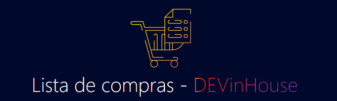
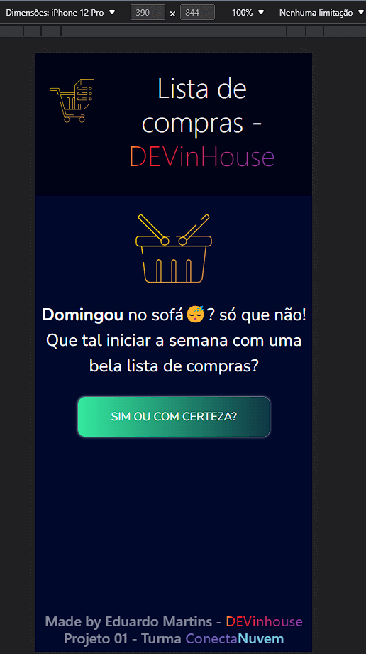
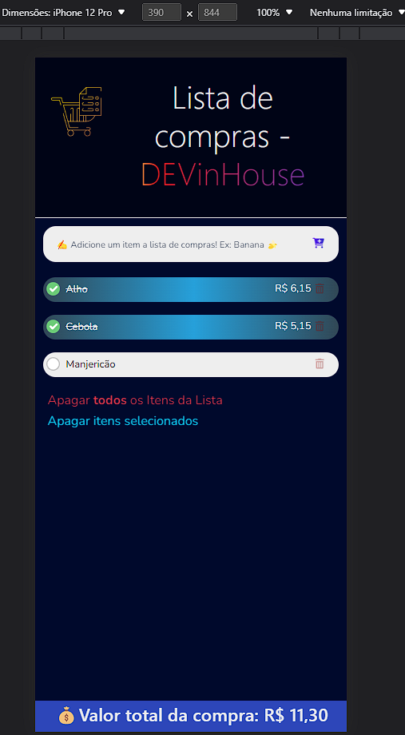
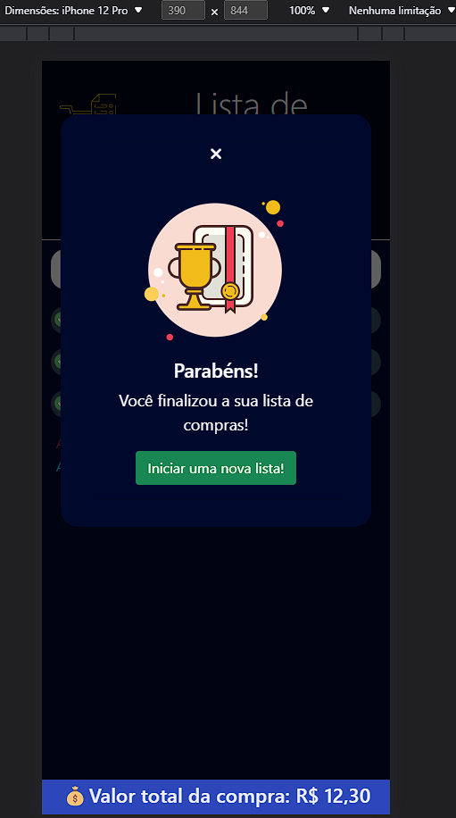
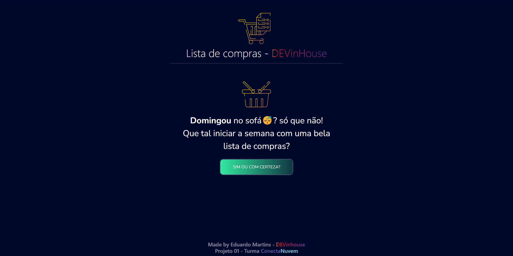
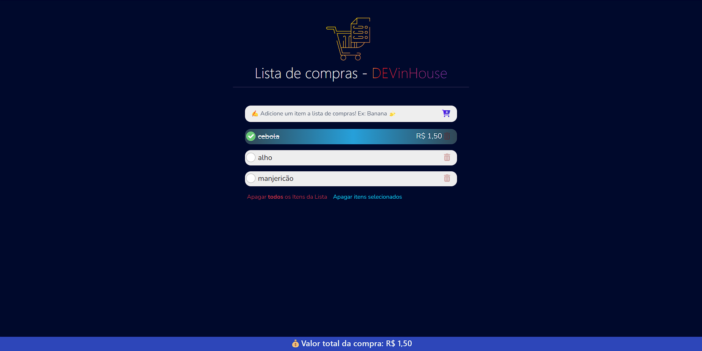
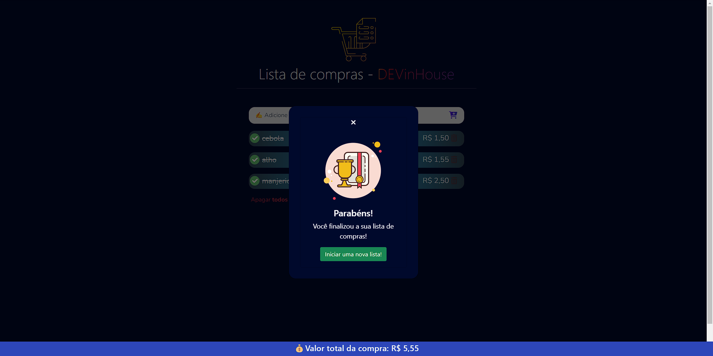

<h1 align="center">
    
</h1>

<p align="center">
  <a href="https://01-conecta-devinhouse.netlify.app/">
    
  </a>
 

</p>

# 💻 Sobre o projeto
<p align="left">Este projeto foi criado para a primeira avaliação do Módulo 01 do curso DEVInHouse em parceria com ACATE e ConectaNuvem. Foram utilizados os conhecimentos adquiridos nas primeiras cinco semanas do módulo. 

A ideia do projeto consiste na construção de uma aplicação de **lista de compras** para inserção de itens pelo usuário, com possibilidade de edição dos itens, exclusão e adição do valor pago. Para alcançar o resultado almejado, os seguintes aprendizados foram aplicados na confecção do projeto:

- HTML: uso das principais tags como head, meta, title, body, div, h1, form, input, button, ul, li. Atributos de tags como class, id, type. Inclusão de arquivos de estilos (css) e de script (js) na página.
- CSS: estilização da página, botões, inputs, alteração de atributos dos elementos da tela de acordo com a interação do usuário, (UX), responsividade a diferentes tamanhos de telas (mobile📱/web💻)
- Javascript: variáveis, arrays, funções síncronas e assíncronas, manipulação do DOM (eventos, elementos e seus atributos), manipulação de objetos (JSON), utilização do localStorage, uso de bibliotecas Javascript.
- Versionamento: utilização do github como ferramenta de versionamento, utilizando os conceitos de gitflow.

O projeto finalizado pode ser conferido no link: <a href>https://01-conecta-devinhouse.netlify.app
</p>


# ⚙️ Instalação

Este projeto possui apenas arquivos HTML, CSS e Javascript, sendo possível sua utilização via clone do repósito.


```bash
# Clone este repositório
$ git clone https://github.com/edumartinsrib/DEVinhouse-Projeto-01-ConectaNuvem
```

# 🛒 Funcionalidades

As seguintes funcionalidades foram implementadas:

- Adição de itens à lista de compras;
- Edição do nome do item após duplo click do mouse;
- Remoção individual de itens da lista;
- Remoção de todos os itens comprados;
- Remoção de todos os itens da lista;
- Adição do valor pago à cada item;
- Visualização do valor total pago da lista.

# 🎨 Layout

<p> O aplicativo foi criado sob o conceito de design responsivo 'mobile first', de modo a atender diversos tamanhos de telas.</p>

## Mobile 📱
<p align="left">
  
</p>

## Web 💻

<p align="left">
  
</p>


# 🖥️ Tecnologias utilizadas:

- JavaScript;
- HTML;
- CSS;
- Bootstrap.


# 🧑‍💻 Autor:

**Eduardo Martins Ribeiro** - [Linkedin](https://www.linkedin.com/in/edumrib/ "Eduardo Martins Ribeiro") - [Email](mailto:edumartinsrib@live.com?subject=ola "Olá!")


# 🤝 Agradecimentos:

A realização deste projeto apenas foi possível em razão do excelente ensino disponibilizado por toda a equipe DEVInHouse e ConectaNuvem. Em especial, meus sinceros agradecimentos a:

- Romeu Isaac Casarotto 
- Ana Paula dos Santos
- Cesar Abascal
- Fernando Puntel 
- Michel Kayser Rohden
- ConectaNuvem
- E demais membros da Equipe DEVInHouse
